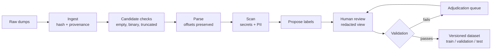

# labelpipe

A privacy-first, human-in-the-loop labeling pipeline. It turns raw incident and log dumps into a versioned, audit-stamped training dataset for a small (1.5B) context-distillation model.

Raw dumps are full of API keys, bearer tokens, and personal data. labelpipe finds and hides them before a person ever sees the text, lets a reviewer check the labels a model proposes, and exports only reviewed, validated records. Everything runs locally; no dump text is sent to a third-party service.

This repository builds the dataset. It does not train the model.

## How it works



- **Offsets, not copies.** Every redaction and label is stored as `start`/`end` character offsets into the raw text. Sensitive text is never copied into labels, exports, or the review page.
- **Offline scanning.** Secrets are found with Presidio plus custom `sk-…` and `Bearer …` recognizers and `detect-secrets`. The scanners make no network calls, so the same input always gives the same spans.
- **A person reviews every record.** Automated scanners can miss things, so nothing is exported without a reviewer's decision: accept, rewrite, skip, reject, or escalate.
- **Validation before export.** A Pydantic model checks offsets, overlaps, and required evidence. Records that fail go back to the reviewer, marked for a second look.
- **Audit log.** Every review action and every request to see unredacted text is appended to `audit.jsonl`, with values hashed (HMAC), not stored in plain text. If the log can't be written, the action is refused.
- **No thread leakage.** The export puts every record from the same source thread into the same split, so training and evaluation data never share a thread.

## Requirements

- Python 3.12
- [uv](https://docs.astral.sh/uv/)

## Quick start

```bash
uv sync

# The review server refuses to start without an audit key
export LABELPIPE_AUDIT_KEY="change-me"

# 1. Load a folder of dumps (one file per dump; the file name is the thread ID)
uv run labelpipe ingest path/to/dumps

# 2. Check, parse, scan, and propose labels; stops at "waiting for review"
uv run labelpipe run

# 3. Review in the browser at http://127.0.0.1:8000
uv run labelpipe serve

# 4. Validate reviewed records (failures go back to the review queue)
uv run labelpipe run

# 5. Export the dataset to data/
uv run labelpipe export --out data --seed v1 --version-tag v1
```

To try it with the sample dumps, run `uv run labelpipe ingest tests/fixtures`.

`labelpipe run` is safe to repeat. Each run moves every record forward as far as it can go, and stops where a person needs to act.

## Reviewing

The review page shows one record at a time with secrets and personal data blacked out; hover a bar to see its type (for example `API_KEY`), click it to request the hidden text. Escalated and failed records come first. The page talks to a small API, which you can also call directly:

| Endpoint | What it does |
| --- | --- |
| `GET /records/next` | Next record to review, redacted, with proposed labels and live validation results |
| `POST /records/{doc_id}/decision` | Record a decision: `{"action": "accept", "span_index": 0}`. Actions are `accept`, `rewrite` (with `new_start`, `new_end`, optional `new_label`), `skip`, `reject`, `escalate` |
| `POST /records/{doc_id}/spans/{i}/unredacted` | Ask to see the hidden text of the i-th redaction, with a `reason`. Denied unless the reviewer is in `LABELPIPE_UNREDACT_ALLOW`; every request is logged |

## The dataset

```text
data/
├── train/<thread_id>.jsonl
├── validation/<thread_id>.jsonl
├── test/<thread_id>.jsonl
└── manifest.json   # version tag, seed, split ratios, policy version, record counts
```

Each line is one record: its redaction and label offsets, the SHA-256 of the raw dump, and audit fields (source system, reviewer, review time, model version, policy version). The raw text itself is not included.

Threads are split 80/10/10 by a hash of `seed:thread_id`. A thread stays in the same split on every re-export. Changing the seed reshuffles all threads. The export checks the result and fails if any thread appears in two splits.

To load the export as a Hugging Face dataset:

```python
from labelpipe.dataset import to_hf

ds = to_hf("data")  # DatasetDict with train / validation / test
```

### Versioning with DVC

The export is also a DVC stage (`dvc.yaml`) that reads its seed and version tag from `params.yaml`:

```bash
uv run dvc repro   # re-exports data/ from labelpipe.db when the DB or params change
```

No DVC remote is configured yet, so dataset versions live in your local DVC cache.

## Configuration

| Variable | Default | Purpose |
| --- | --- | --- |
| `LABELPIPE_AUDIT_KEY` | none (required by `serve`) | Secret key used to hash audit log values |
| `LABELPIPE_AUDIT_LOG` | `audit.jsonl` | Where the audit log is written |
| `LABELPIPE_DB` | `labelpipe.db` | SQLite database (same as `--db`) |
| `LABELPIPE_REVIEWER` | `reviewer` | Reviewer name recorded on decisions |
| `LABELPIPE_UNREDACT_ALLOW` | empty | Comma-separated reviewers allowed to view unredacted text |

`labelpipe.db`, `data/`, and `audit.jsonl` hold raw dumps or derived data and are ignored by git.

## Project layout

```text
labelpipe/
├── intake.py      # read a dump, hash it, record where it came from
├── checks.py      # reject empty, binary, or truncated dumps
├── parse.py       # spaCy parse that keeps the original text and offsets
├── scan.py        # Presidio + detect-secrets → redaction spans
├── propose.py     # label proposer interface (a stub until the model is plugged in)
├── runner.py      # moves each record through the stages by status
├── validate.py    # checks before a record can be exported
├── schema.py      # Pydantic record and span models
├── audit.py       # append-only HMAC audit log
├── dataset.py     # thread-grouped export and splits
├── db.py          # SQLite tables
├── cli.py         # labelpipe ingest | run | serve | export
└── review/        # FastAPI review API and the single-page review UI
tests/             # one test file per area, plus sample dumps in fixtures/
```

## Tests

```bash
uv run pytest
```

## Current limits

- The label proposer is a stub (`StubProposer`) that proposes one `UNKNOWN` span per record. A real model plugs in through the `Proposer` interface in `propose.py`.
- The spaCy pipeline is blank, so name and location detection (PERSON, LOC) is off. Load an `en_core_web_*` model in `scan.py` to turn it on.
- One reviewer at a time. Adjudication is a "needs a second look" flag, not a multi-reviewer workflow.
- The thread ID is the dump's file name until dumps carry a real thread key.
